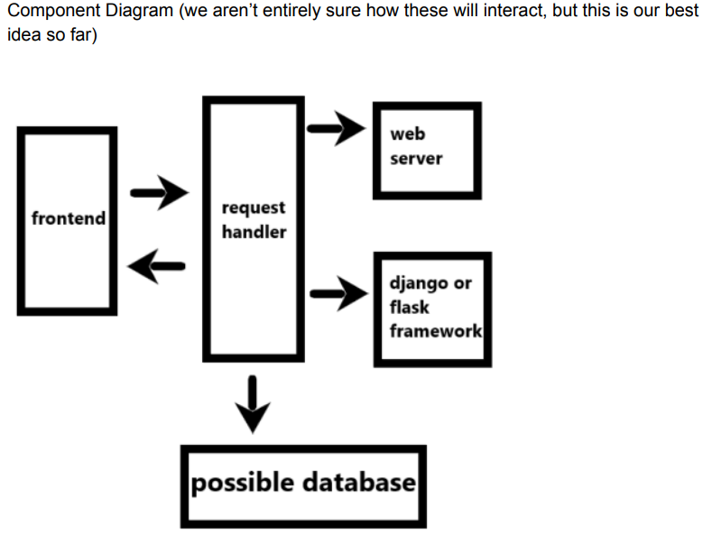

README

# Final Presentation Information:

## Summary of Presentation Introduction:
- WebWhiteboard is an online website that allows users to draw, make notes and express creativity. The application is a simple and easy to use note taking app where people can The main benefits of our app in comparison to other web paint applications is that there are no constraints on our application, from infinite zoom to unlimited drawing and checklist capabilities users can let their creativity run wild.

## Describes technical architecture:
- There are three main components to our Web application. We have a whiteboard where you can draw using any color in the RGB spectrum using either a pixel brush or a vector brush which comes with infinite zoom. We have a checklist that does exactly what you would expect it to do, allows you to make a checklist and check them off or remove them when you are finished. Finally, we have a notes page where you can add, edit, and remove notes for yourself. 
- The role of the whiteboard is to allow the user to make drawings. It is separate to the checklist and the notes page. The functionality was wrote in JavaScript with HTML and CSS being used to format the drawing space and buttons around it.
- The role of the checklist was to allow the user to make a checklist and check off events as they go. The checklist does not interact with the other components of our web application. The functionality, similarly to the whiteboard was wrote in JavaScript, HTML, and CSS.
- The role of the notes page was to allow users to take and save notes. Again, the notes component is separate to both the checklist and whiteboard, and it was wrote in JavaScript, HTML, and CSS.

## Installation instructions:
The application is a website (link: https://nkozlo3.github.io/C222_Notes-WebApp/). There are no installation instructions besides cloning the github and running live server on vscode if you'd like to run the app on localhost. 

## Group Members and Roles:
- Roles were very relaxed and people collaborated on basically everything throughout the project.
- Colsen Stiles (frontend, webgl canvas / drawing functionalities)
- Neil Kozlowski (frontend, notes functionality, checklists)
- Matthew Bosch (backend, color slider / drawing functionalities)
- Ananth Hariharan (backend / notes functionality)

# Project Proposal:

## Pitch

WebWhiteboard is a simple and easy, cross-platform whiteboard web app where anyone can take notes for classes or become an artist and express their creativity. WebWhiteboard allows a portable solution for mapping out complex ideas.

## Functionality

specific actions that users can complete in your project:

1. Draw lines on the canvas using pencil/paintbrush
2. Change the color of paintbrush
3. Write text in text boxes on the whiteboard
4. Download notes/drawings
5. Add a post it note to the whiteboard
6. Erase stuff from the whiteboard
7. Prebuilt shape where you can change the size
8. Selection Tool

## Components

Frontend: TypeScript/JS, HTML canvas or WebGL, and CSS. CSS will be utilized to make the web app look pretty and to improve the UX. HTML will be essential for getting the web app up and running but we don’t expect to be using a lot of HTML. TypeScript/JS will be what we write the bulk of our web app features in and will be used for things such as text boxes and typing capabilities as well as the eraser capabilities and different colors. We also might look into possible frontend frameworks like React and Next.js. For testing purposes we will probably use unit tests or possibly some library.

Backend: We will write the backend using Python and either the Flask and Django framework. Two of our team members are familiar with python and one has already developed a backend with Django. Both frameworks are widely used so there is plenty of documentation and tutorials available online. We aren’t entirely sure about the necessary responsibilities for the backend besides for setting up the server / hosting side of the project. In the future we might decide to incorporate a small database to allow users to save notes somehow. The backend might also be helpful for incorporating the prebuilt shapes and downloading functionality of the web application. If necessary/possible we will incorporate some form of unit tests to ensure proper functionality of our backend code.

We are going to use github to manage the project workflow and have two separate branches one for backend and another for frontend.

We chose to separate the project into frontend and backend because it allows us to work in parallel on both sections and split up the work easier between group members.

  

## Schedule (For each of these eight weeks, describe at least two specific high-level tasks you plan to complete)

<ol> 
    <li>Setting up github stuff, getting local development stuff ready</li>
    <li>Skeleton web app with the whiteboard and drawing capabilities</li>
    <li>Implement eraser capabilities and different colors for drawing</li>
    <li>Add text boxes and typing capabilities</li>
    <li>Pre-built shapes and certain sketches auto-fix</li>
    <li>Post-it notes and make notes downloadable</li>
    <li>Make note app aesthetically pleasing, work on UX/UI</li>
    <li>Selection tool and general debugging/ filler week</li>
</ol>

## Potential Risks (at least three possible risks + plan to resolve each)

<ol>
    <li>Issues with setting up the backend to interact with the frontend since we have little experience with this. Possible solutions are: asking our mentor for advice/help and doing research to figure out how to implement what we want.</li>
    <li>HTML canvas might not be robust enough for the functionality we are trying to implement, so we might need to use another tool to implement the drawing capabilities. Possible solutions are: asking our mentor for advice/help and doing research to figure out how to implement what we want.</li>
    <li>Not being able to accomplish one of our weekly goals due to a random bug or other complicated issue. Possible solution: leaving a filler week or two in our schedule to account for possible hiccups. We can always implement more later if we have time.</li>
</ol>

## Teamwork

One way to reduce friction when collaborating is to always communicate. In our case specifically, communication will be important since we aren’t all completely familiar with each other and the different technology we are using in this project. We plan on dividing up the work for the project into two teams: frontend and backend. To start with, Colsen Stiles and Neil Kozlowski will work on the frontend portion since they wanted to practice/learn Typescript. Ananth Hariharan and Matthew Bosch will work on the backend. If one team finishes early they will help the other team. None of us know how to set up a docker environment but we might ask our mentor for help in setting one up since the docker env would be helpful for keeping dev environments consistent across our entire team.

## Continuous Integration

Two possible testing libraries for the backend (in python) are pytest and pyunit (unittest).
Two possible testing libraries for the frontend (in JS) are MochaJS and react testing
library (if we use react). For the style guide, we currently plan to use google style guide
for both javascript and python. To calculate test coverage we will divide the number of
lines that are covered by a test and divide by the total number of lines in the part of our
application covered by that test (ex some tests will cover backend, others frontend). Our
plan for continuous integration is to make a branch for each new feature. After
completing the feature we would then make a pull request using github and merge it
back into main (after code review).

## Links for project info:

1.  Introduction (illinois.edu)
2.  Project Planning (illinois.edu)
    Project Proposal Guidelines (illinois.edu)
    Sample Proposal

whiteboard/paint/notability web application
Backend: python w/flask or django
Frontend + most of the functionality/drawing..: typescript/js + HTML canvas or WebGL
